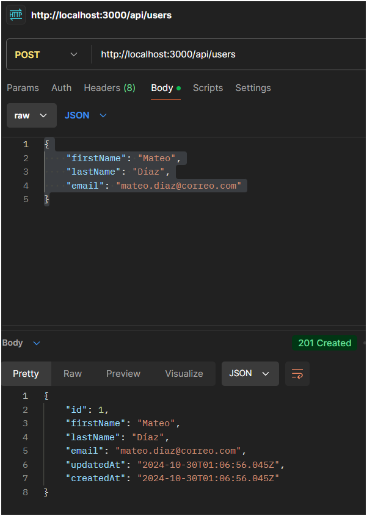
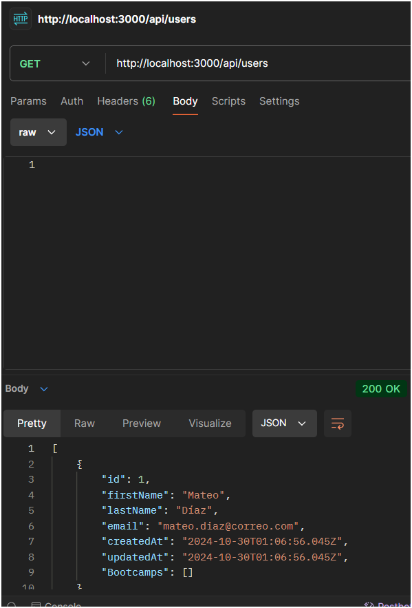
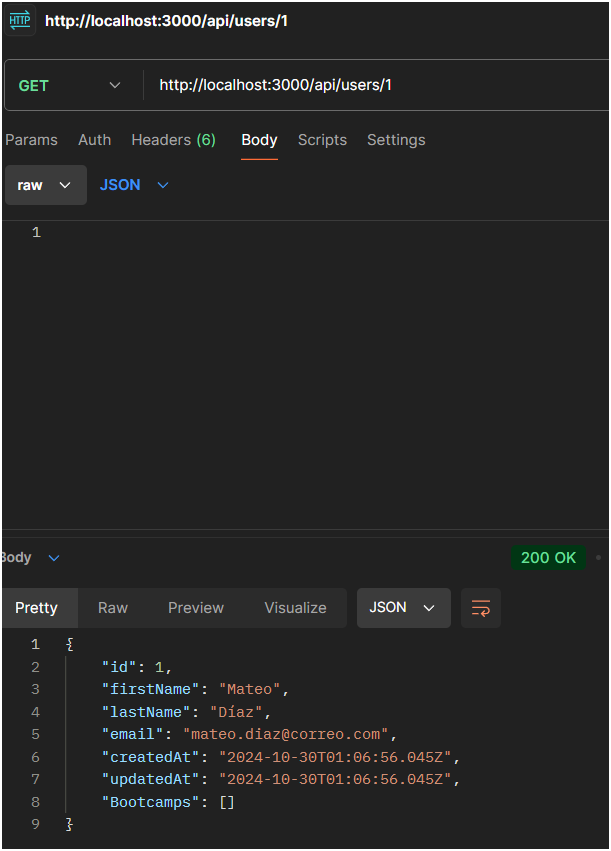
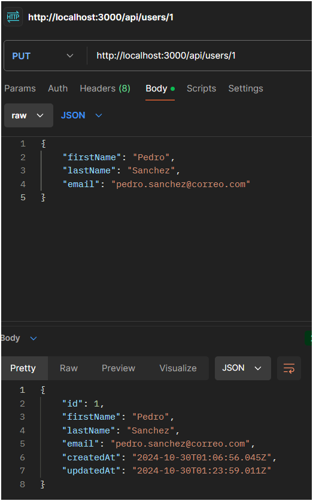
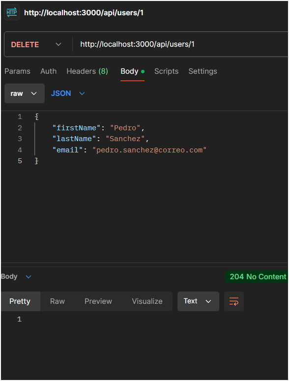
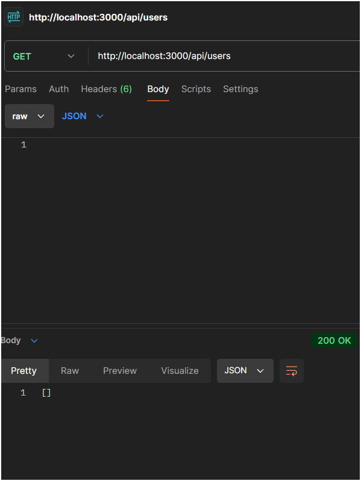
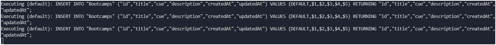
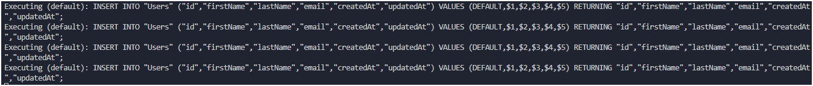
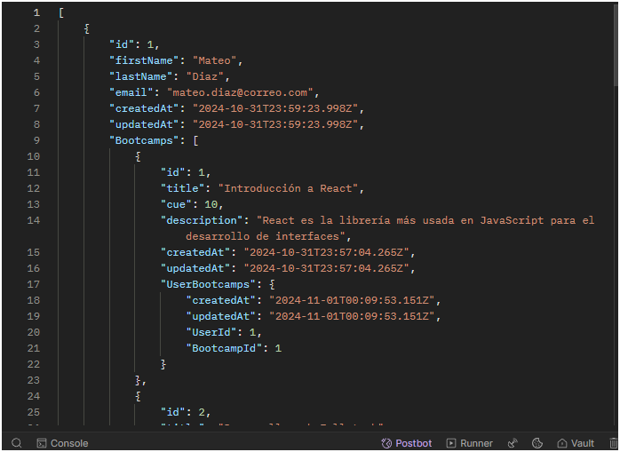

# Node.js + Express + Sequelize + PostgreSQL
Aplicación usando Node.js con Sequelize y PostgreSQL que permite gestionar usuarios y bootcamps.

---

Requisitos:

`npm i sequelize pg pg-hstore express body-parser -y`

<figure>
    
    <figcaption>Modelo</figcaption>
</figure>

<figure>
    
    <figcaption>Estructura archivos</figcaption>

---

## Instrucciones:
- [x] Estructurar carpetas
- [x] Crear archivo `db.config.js`
  - BONUS: Averiguar sobre dotenv para usar variables de entorno
- [x] Crear modelos
  - [x] `user.model.js`
  - [x] `bootcamp.model.js`
  - [x] `index.js` Para conectar Sequelize
- [x] Crear Controladores
  - [x] `user.controller.js` Para el CRUD
  - [x] `bootcamp.controller.js` para métodos
- [x] `server.js` verificar conexión, cargar modelos y controladores
- [x] Insertar datos (usuarios, bootcamps y asignar)
- [x] Consultas SQL


## Inserción de datos a través de postman
1. Crear Usuario
   <figure>
    
    <figcaption>Usuario creado con post</figcaption>
2. Obtener todos los usuarios
   <figure>
    
    <figcaption>Obtenido usuario con GET</figcaption>
3. Obtener usuario por ID
    <figure>
    
    <figcaption>Obtenido usuario por su ID con GET</figcaption>

4. Actualizar usuario
   <figure>
    
    <figcaption>Actualizado a través de la ID</figcaption>
5. Eliminar usuario
   <figure>
    
    <figcaption>Usuario eliminado</figcaption>

    

## Datos requeridos.
Se hará su inserción a través de Postman.

Usuarios:
- Mateo Diaz, mateo.diaz@correo.com
  - Introducción a React
  - Desarrollo web fullstack
  - Big data, IA & ML
- Santiago Mejías, santiago.mejias@correo.com
  - Introducción a React
  - Big data, IA & ML
- Lucas Rojas, lucas.rojas@correo.com
  - Big data, IA & ML
- Facundo Fernandez, facundo.fernandez@correo.com

Bootcamps:
- Introducción a React, cue 10, "React es la librería más usada en JavaScript para el desarrollo de interfaces"
- Desarrollo web Fullstack, cue 12, "Crearás aplicaciones web utilizando las tecnologías y lenguajes más actuales y populares, como: JavaScript, nodeJS, Angular, MongoDB, ExpressJS"
- Big Data, IA & ML, cue 18, "Domina Data Science, y todo el ecosistema de lenguajes y herramientas de Big Data, e intégralos con modelos avanzados de Artificial Intelligence y Machine Learning".

Lo primero es crear los bootcamps, luego los usuarios y finalmente asignarlos.


Y finalmente hacemos un GET de users para ver todas las asignaciones:


---
### Log de errores:
- No se encontró models porque algunas rutas relativas estaban escritas con `./` y otras como `../`
  - Solucionado, recordar siempre que:
    - `./` indica "desde esta misma ruta"
    - `../` indica "desde la ruta anterior", básicamente subir un nivel
- La primera consulta de POST me arrojó error 500:
```
  post: {
    "message": "Error al crear el usuario: ",
    "error": "Cannot destructure property 'firstName' of 'req.body' as it is undefined."
  }
  ```
- A considerar: middleware `app.use(bodyParser...)` debe ir antes de `app.use('/api', routes)`, esto porque primero debe poder parsear (leer, entender) las rutas antes de llamarlas y lo estaba haciendo al revés.
- Solucionado `lastname` en la linea 14 de `./app/models/user.model.js`, debería ser `lastName`(mayúscula)
- Al lanzarlo nuevamente me pasó esto:
```
{
    "message": "Error al crear el usuario: ",
    "error": "column \"lastName\" of relation \"Users\" does not exist"
}
```
  - Sucede que seguía leyendo `lastname`, así que en `server.js`, línea 18, cambié la sincronización `({force: true})`, relanzar, probar (funcionó) y volverlo a `({force: false})`
    - Con esto forzamos a volver a crear las relaciones y las tablas.

- Imposible insertar dos de los bootcamps porque cues tienen límite de 10 y eran más altos. Se ajustó el límite superior a 20 y se repitió el proceso anterior de forzar sinc.
- Para realizar la asignación de usuarios a bootcamps, a través de API, se debe crear una ruta y un método para ello. Con ello podemos asignar un usuario a un bootcamp a través de ID. Fue tremendo dolor de cabeza la verdad porque me olvidé importar los bootcamps al user controller.
  - Ya con esto creado, usamos POST y enviamos `http://localhost:3000/api/users/1/bootcamps/1`, donde 1 es la ID de usuario y la ID de bootcamp. En este caso estamos asignando bootcamp 1 (Introducción a React) al usuario 1 (Mateo Diaz).