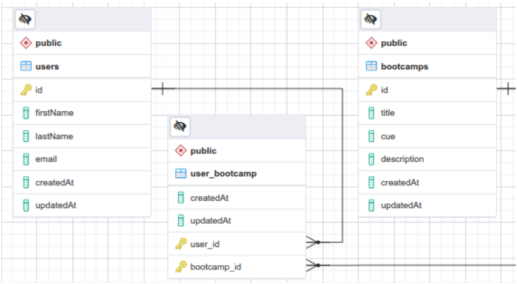
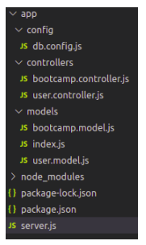

# Node.js + Express + Sequelize + PostgreSQL
Aplicación usando Node.js con Sequelize y PostgreSQL que permite gestionar usuarios y bootcamps.

---

Requisitos:

`npm i sequelize pg pg-hstore express body-parser -y`

<figure>
    
    <figcaption>Modelo</figcaption>
</figure>

<figure>
    
    <figcaption>Estructura archivos</figcaption>

---

## Instrucciones:
- [x] Estructurar carpetas
- [x] Crear archivo `db.config.js`
  - BONUS: Averiguar sobre dotenv para usar variables de entorno
- [x] Crear modelos
  - [x] `user.model.js`
  - [x] `bootcamp.model.js`
  - [x] `index.js` Para conectar Sequelize
- [ ] Crear Controladores
  - [ ] `user.controller.js` Para el CRUD
  - [ ] `bootcamp.controller.js` para métodos
- [x] `server.js` verificar conexión, cargar modelos y controladores
- [ ] Insertar datos (usuarios, bootcamps y asignar)
- [ ] Consultas SQL